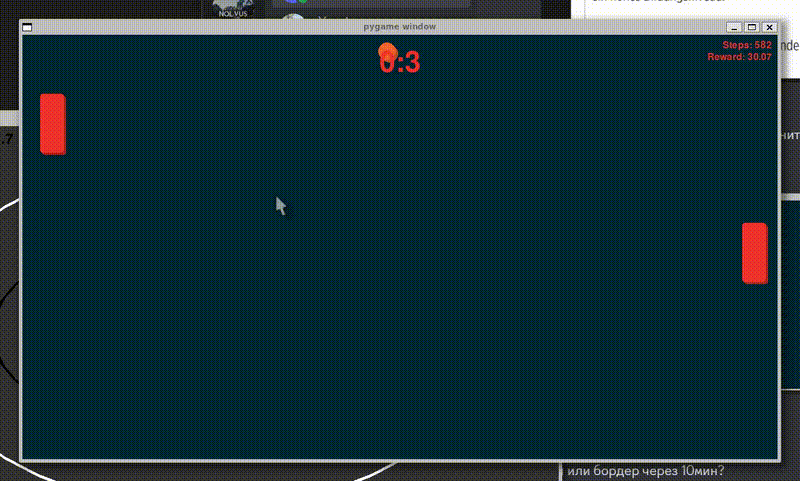

# Pong RL

A reinforcement learning environment implementing the classic Pong game using Pygame and Gymnasium. The environment includes both a playable version and training capabilities using Stable Baselines 3.



[▶️ Watch full video](pong.mp4)

## Features

- Custom Gymnasium environment for Pong
- Human playable mode with keyboard controls
- AI training using PPO (Proximal Policy Optimization)
- Real-time visualization of training progress
- Configurable game parameters (speed, size, colors)
- Visual effects (shadows, smooth animations)

## Usage

### Playing the Game

Run the play script to play against the hardcoded AI:
```bash
python scripts/play.py
```

Controls:
- Up Arrow: Move paddle up
- Down Arrow: Move paddle down
- ESC: Quit game

### Training an Agent

To train a new agent:
```bash
python scripts/train.py
```

The training script will:
- Create a new run directory in `logs/`
- Save the best model during training
- Log metrics to TensorBoard
- Display periodic evaluation episodes

### Evaluating a Trained Agent

To evaluate a trained model:
```bash
python scripts/eval.py
```

## Development

For development, install additional dependencies:
```bash
pip install -r requirements-dev.txt
```

## Acknowledgments

- Built with [Pygame](https://www.pygame.org/)
- RL implementation using [Stable Baselines3](https://stable-baselines3.readthedocs.io/)
- Environment interface with [Gymnasium](https://gymnasium.farama.org/)
